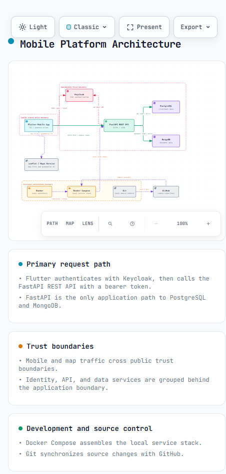

	

# Práctica 02 - Boceto de Arquitectura con Archify

Diagrama de arquitectura de un sistema móvil elaborado con Archify.

## Diagrama de arquitectura

Vista previa del diagrama:

El diagrama interactivo se muestra directamente desde GitHub Pages cuando el visor Markdown permite contenido incrustado:

	<iframe
		src="https://jonathan2536.github.io/Integradora_230318/Practica2/"
		title="Diagrama de arquitectura del sistema móvil"
		width="100%"
		height="700"
		frameborder="0"
		allowfullscreen>
	</iframe>

Si la vista de GitHub bloquea el contenido incrustado, ábrelo en una pestaña nueva:

También puedes visualizarlo mediante GitHub Pages:

## Descripción

Esta práctica presenta una representación visual e interactiva de la arquitectura propuesta para un sistema móvil. El diagrama incluye la capa móvil, autenticación, API, datos, servicios externos e infraestructura de desarrollo.

## Estructura de la práctica

- [`index.html`](./index.html): diagrama interactivo de arquitectura.
- [`architecture-diagram.png`](./architecture-diagram.png): vista previa del diagrama para el README.
- [`mobile-system-architecture.architecture.json`](./mobile-system-architecture.architecture.json): definición de la arquitectura.
- [`mobile-system-architecture.visual-check.json`](./mobile-system-architecture.visual-check.json): configuración de comprobación visual.

## Estado

| Práctica | Nombre | Herramienta | Estatus |
|---|---|---|---|
| 02 | Boceto de Arquitectura con Archify | Archify y Codex de OpenAI | Completada [x] |
