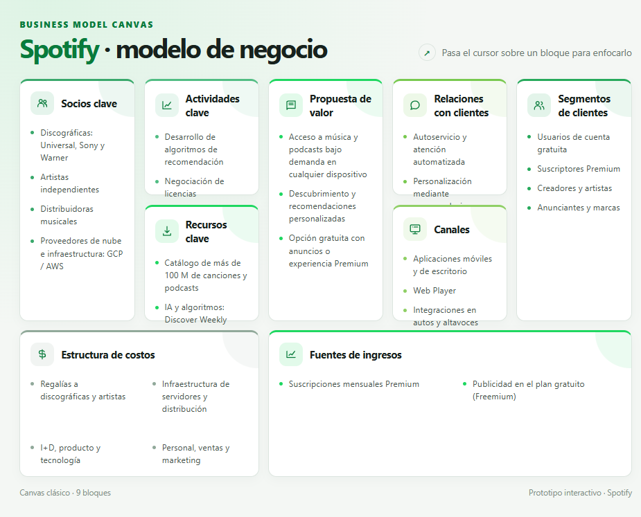

  

# Práctica 03 - Business Model Canvas de Spotify

Representación visual e interactiva del modelo de negocio de Spotify mediante la metodología Business Model Canvas.

## Modelo Canvas

Haz clic en la imagen para abrir el modelo interactivo completo:

También puedes visualizar el modelo mediante GitHub Pages:

La página pública del modelo está disponible en:

<https://jonathan2536.github.io/Integradora_230318/Practica3/spotify_canvas.html>

## Descripción

Esta práctica analiza cómo Spotify crea, entrega y captura valor dentro del mercado de música y podcasts en streaming. El modelo organiza la información de la empresa en nueve bloques principales para mostrar sus operaciones, clientes, recursos, costos e ingresos.

## Objetivo

Identificar los elementos que conforman el modelo de negocio de Spotify y presentarlos en una interfaz web clara, responsive e interactiva.

## Bloques del modelo Canvas

| Bloque | Elementos principales |
|---|---|
| Socios clave | Discográficas, artistas independientes, distribuidoras y proveedores de nube. |
| Actividades clave | Desarrollo de recomendaciones, negociación de licencias, mantenimiento y marketing. |
| Recursos clave | Catálogo musical, algoritmos de inteligencia artificial, marca y datos de escucha. |
| Propuesta de valor | Música y podcasts bajo demanda, recomendaciones personalizadas y planes Free/Premium. |
| Relaciones con clientes | Autoservicio, atención automatizada, personalización y comunidad digital. |
| Canales | Aplicaciones móviles y de escritorio, Web Player, automóviles y altavoces inteligentes. |
| Segmentos de clientes | Usuarios gratuitos, suscriptores Premium, creadores, artistas, anunciantes y marcas. |
| Estructura de costos | Regalías, infraestructura, investigación, producto, personal, ventas y marketing. |
| Fuentes de ingresos | Suscripciones Premium y publicidad del plan gratuito. |

## Funcionamiento interactivo

- Cada bloque del Canvas puede enfocarse al pasar el cursor sobre él.
- Los bloques también pueden seleccionarse mediante el teclado.
- El diseño se adapta a pantallas de escritorio, tabletas y dispositivos móviles.
- La interfaz incluye una vista visual de los nueve bloques y una organización diferenciada para costos e ingresos.

## Tecnologías utilizadas

- HTML5 para la estructura del modelo.
- CSS3 para el diseño visual, distribución responsive, colores y animaciones.
- JavaScript para la interacción con el cursor y el teclado.
- SVG integrado para los iconos de cada bloque.

## Estructura de la práctica

- [`index.html`](./index.html): entrada de GitHub Pages que abre el modelo Canvas.
- [`spotify_canvas.html`](./spotify_canvas.html): modelo Canvas interactivo de Spotify.
- [`spotify-canvas-preview.png`](./spotify-canvas-preview.png): vista previa del modelo para este README.

## Resultado

El resultado es un prototipo web autónomo que permite consultar de forma visual los componentes del modelo de negocio de Spotify, sin necesidad de instalar dependencias adicionales.

## Estado

| Práctica | Nombre | Tema | Estatus |
|---|---|---|---|
| 03 | Business Model Canvas de Spotify | Modelo de negocio | Completada [x] |
